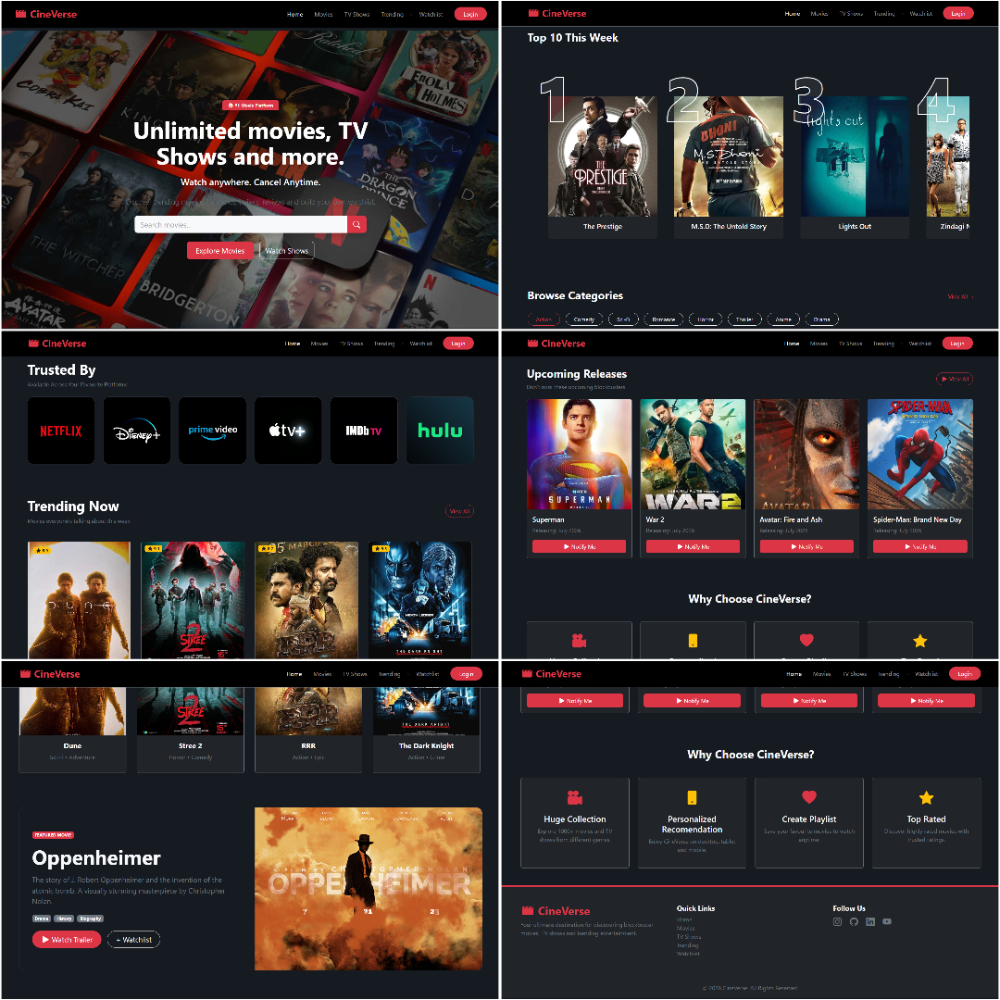
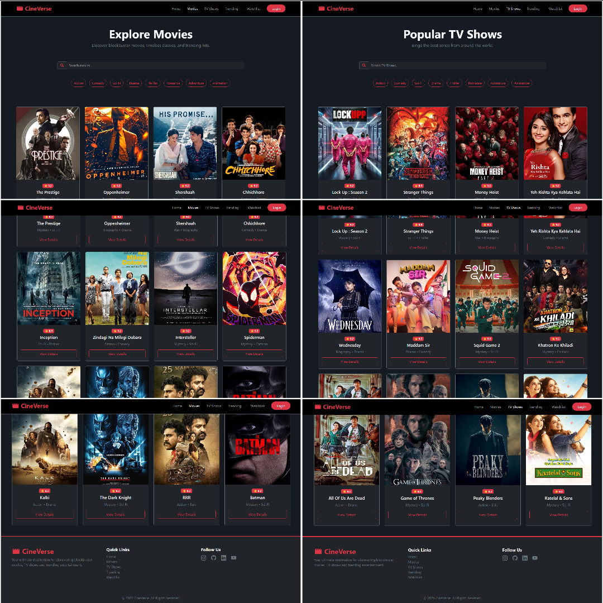
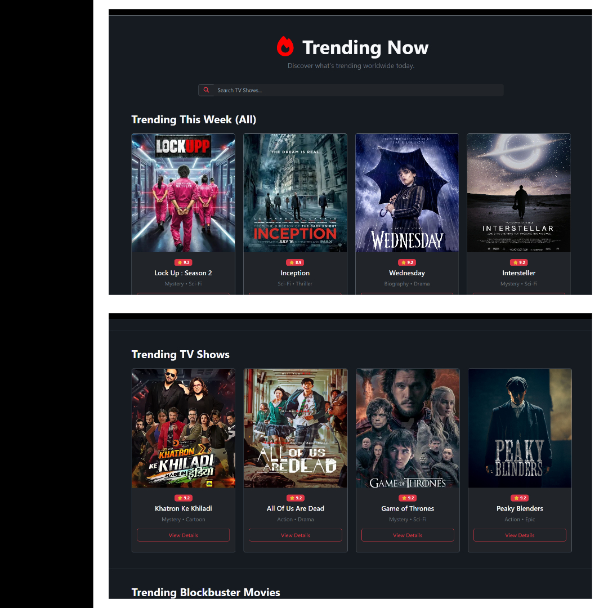
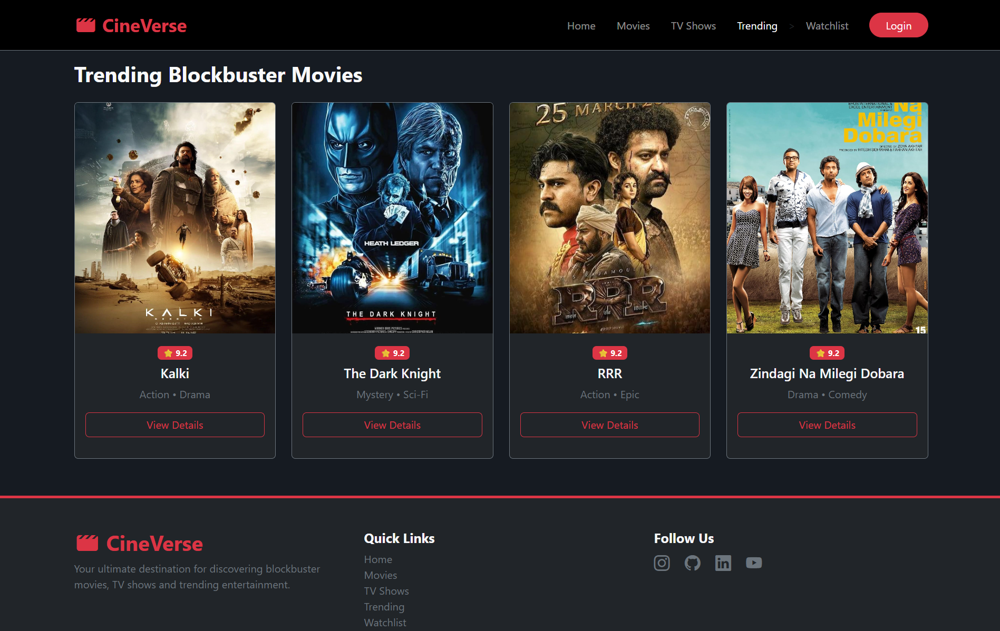
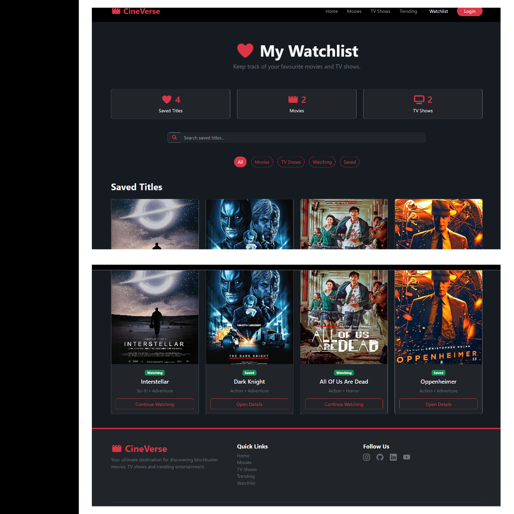
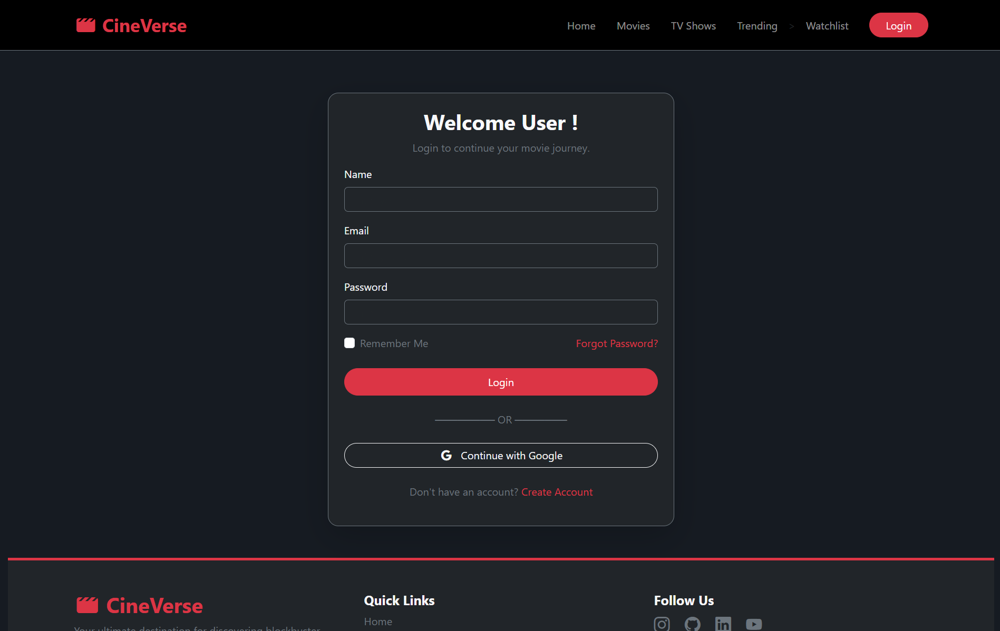
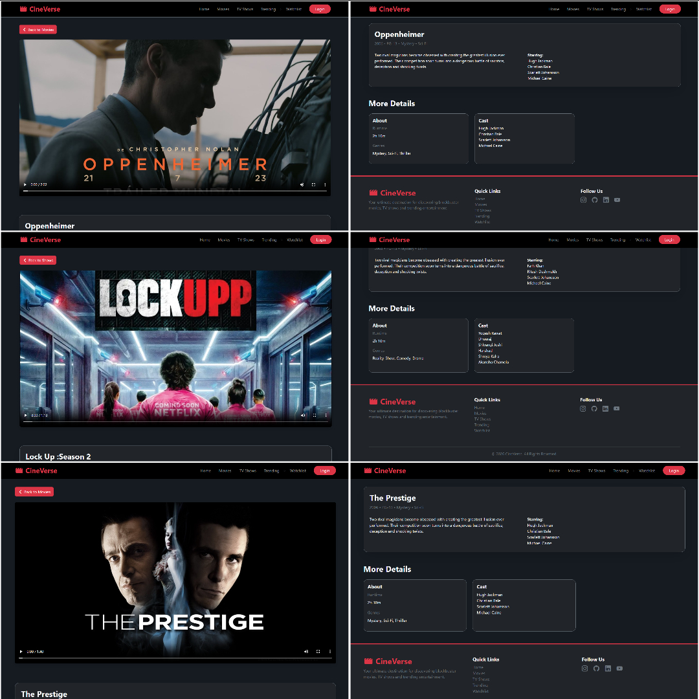

#  CineVerse
A responsive OTT-inspired Movie & TV Show platform built using HTML, CSS, Bootstrap and JavaScript.

##  Live Website
https://arfakabadi-001.github.io/cineverse-movie-platform/

##  Features
- Responsive UI
- Movies
- TV Shows
- Trending
- Wishlist
- Login Page
- Featured Movie Trailer
- Movie Detail Pages
- Coming Soon Page

##  Tech Stack
- HTML5
- CSS3
- Bootstrap 5
- JavaScript
- Font Awesome
- Bootstrap Icons

#  Screenshots

##  Home

---

##  Movies and TV Shows

---

##  Trending

---

##  Wishlist

---

##  Login

---

##  Movies & Shows Details

---

##  Future Improvements
- Movie Search
- Watchlist using Local Storage
- TMDB API
- User Authentication
- Dark / Light Mode

---

##  Author
**Arfa Kabadi**
GitHub:
https://github.com/arfakabadi-001